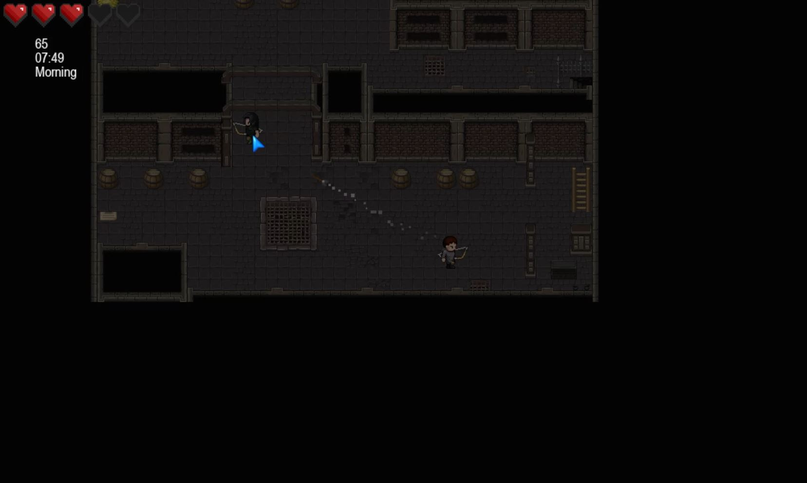
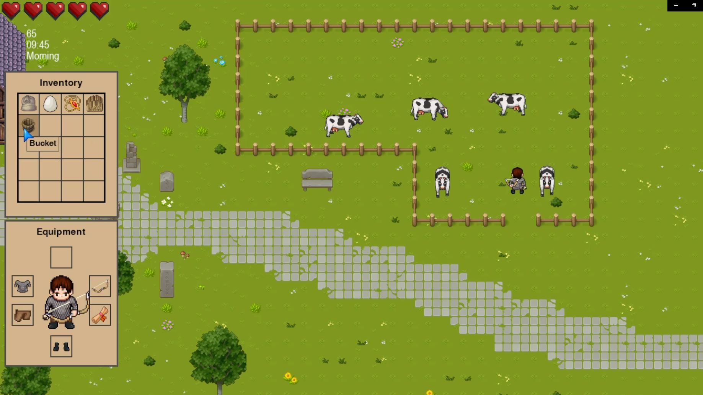
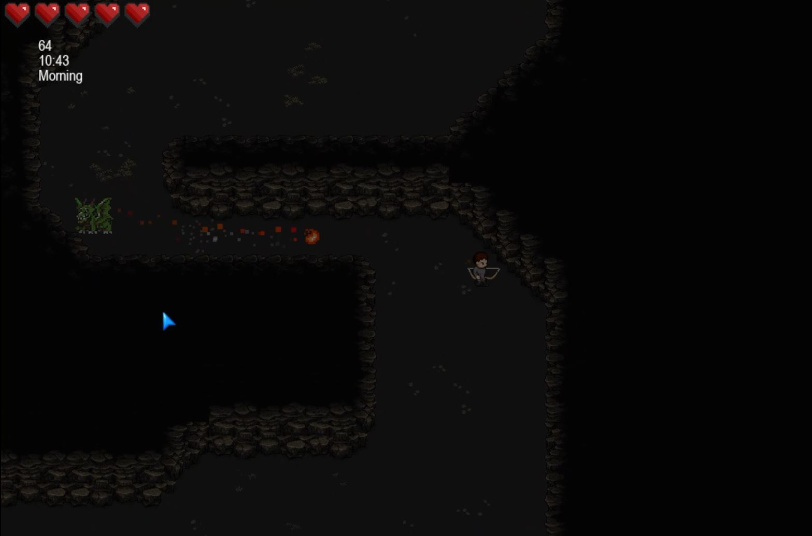
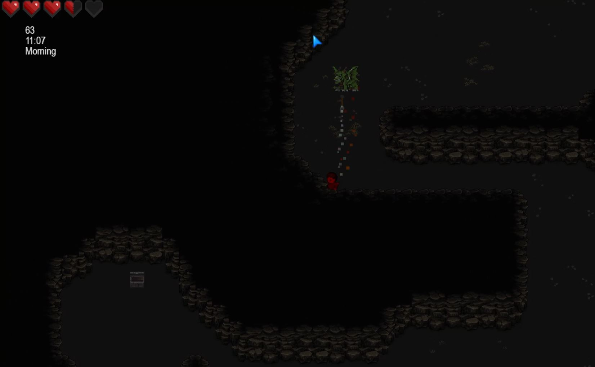
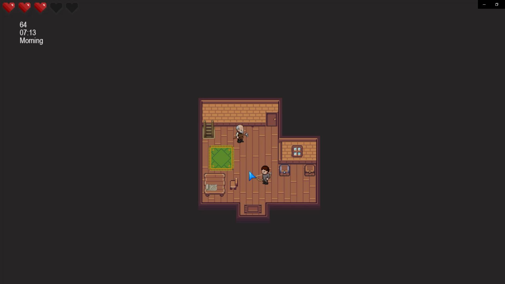
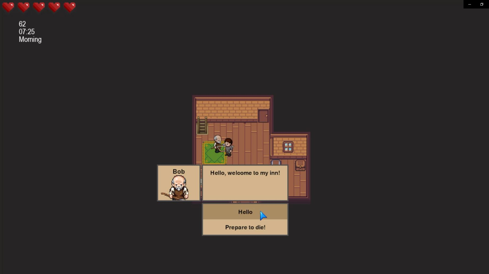
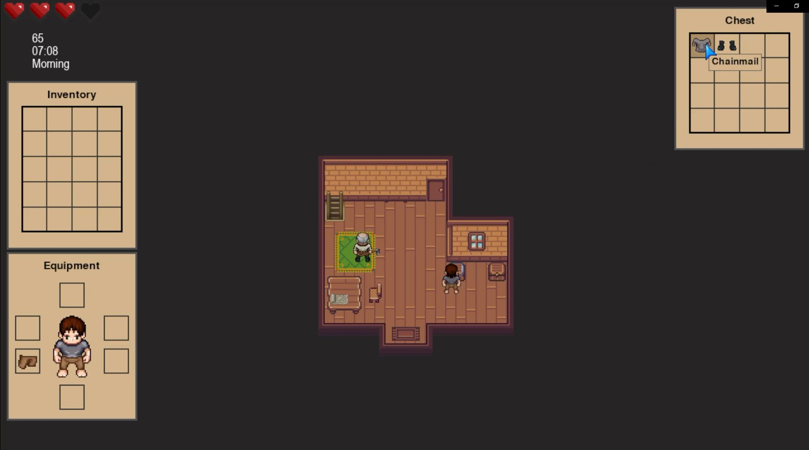
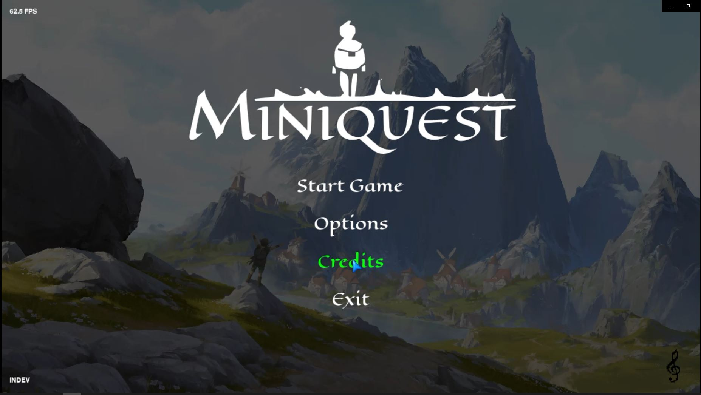
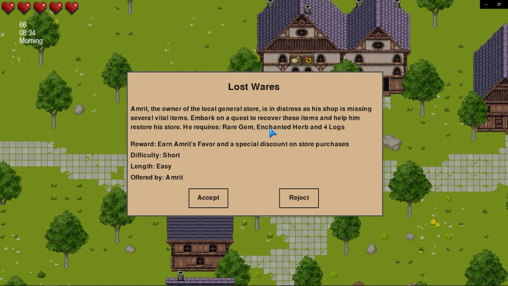

## About MiniQuest
---
### View the [YouTube Prototype Demo!](https://youtu.be/wl9MrimpCZA)

## Screenshots

Here are some in-game screenshots from MiniQuest that show various gameplay areas and features:

---
Welcome to MiniQuest, a  top-down adventure game where  the journey is full of unexpected twists and turns. Play as a village farmer thrown into a heroic journey after a dragon attack devastates your peaceful life. Brace yourself for an epic quest around the world to seek justice, explore the world, complete quests, collect items, discover secrets, and make new allies.

## Gameplay
### Mechanics
The player can interact with the world in various ways. MiniQuest features multiple maps, which the player can traverse and explore. Each map has its own quests, enemies, loot, puzzles and much more. Players will be able to interact with objects around the world. For example, a player may be able to access chests, reads signs, talk to NPCS, cast spells, complete quests and slay monsters. The player will be able to obtain different weaponry, which will have its own projectile, damage and speed. The player can also obtain artefacts that grant unique ways to play the game through magical abilities.

### Controls
The player can move their character using the WASD keys. W moves the character forward, A moves them left, S moves them backward, and D moves them to the right. 

The player can attack enemies by left-clicking the screen. The type of attack performed depends on the weapon the character is currently holding. For example, a sword might trigger a slashing motion, while a bow would release an arrow towards the cursor.

The player can activate artefacts by right-clicking the screen. Some artefacts will be click position dependant (such as a teleport artefact) and others will not rely on click position (such as an invisibility artefact).

The E key is used for interactions. This includes opening chests, unlocking doors, reading signs, initiating conversations with NPCs, and activating hidden passageways and secrets.
 
The player can access their inventory and game menus by pressing the TAB and Esc keys, respectively. In the inventory, players can equip new items, use consumables, and view their character's stats and abilities. The game menu provides access to options such as saving and loading the game, adjusting settings, and exiting to the desktop.

### Level Design
MiniQuest employs a sprawling world map that consists of multiple, distinct smaller maps, each featuring its own unique environment, challenges, and storylines. 

Certain areas have "inner maps" or "interiors", such as houses, castles, or dungeons. These interior maps often feature puzzles, quests, or enemies that are specific to that location. For example, a dungeon might be filled with traps and monsters, while a castle may contain political intrigue and quests. Interiors serve to deepen the world's lore, provide context to its inhabitants, and offer a change of pace from the outside world.

The world will feature a day/night cycle and a weather system. 

## Technical
### Platforms
MiniQuest is initially being designed for the Windows platform. This choice allows us to focus our resources and testing on creating the best possible experience for a large user base. As the game evolves, we will consider expanding to additional platforms based on player demand and feasibility.

### Game Engine and Language
MiniQuest is developed using the Pygame CE library, a set of Python modules designed for game creation. It provides the functionality required for game development, including graphics, sound, and input handling, making it an ideal choice for MiniQuest's development.

We chose Python as our programming language due to its readability, simplicity, and vast standard library. Python is well-suited for quickly prototyping and iterating on game concepts, which aligns with our agile approach to game development.

For designing our game's world, we are utilizing Tilemaps. This method allows us to create complex, grid-based environments efficiently and effectively. It is a widely used technique in 2D game development, particularly in creating RPGs like MiniQuest, and provides us the flexibility we need in creating diverse and engaging levels.

MiniQuestDEV: Copyright Notice

Copyright © 2023-2025 by Harry Bridgen. All rights reserved.
